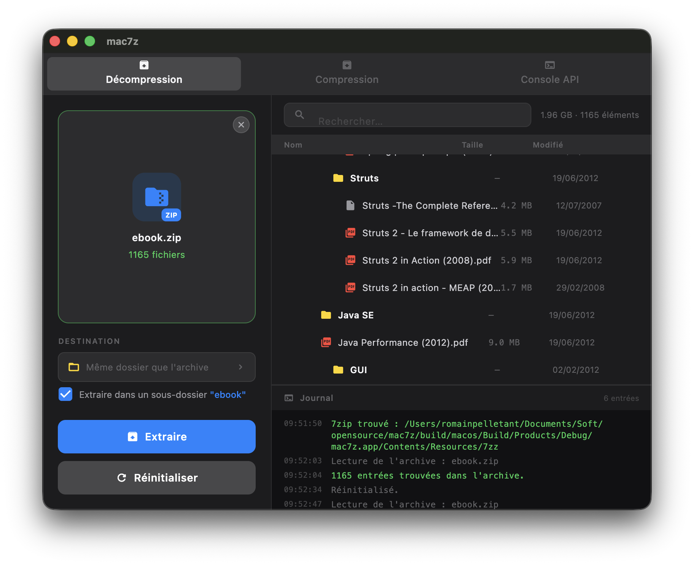
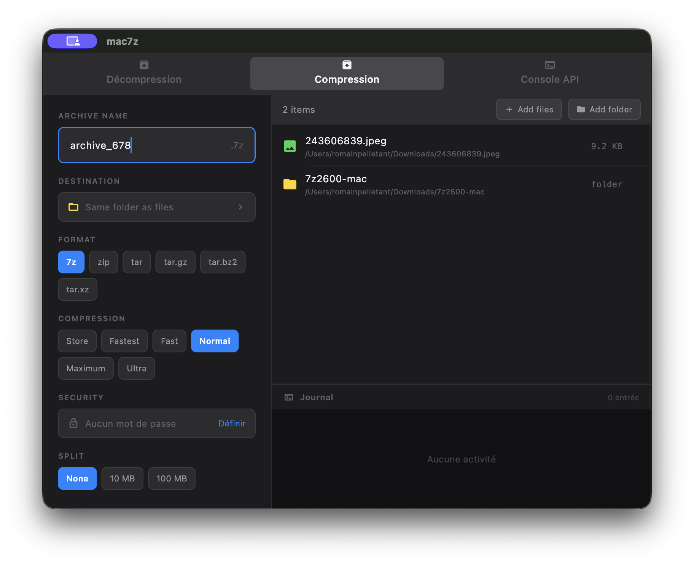

<p align="center">
  
</p>

<h1 align="center">mac7z</h1>

<p align="center">
  Archive manager for macOS &amp; Linux, powered by 7-Zip
</p>

<p align="center">
  <a href="https://github.com/romainpelletant/mac7z/actions/workflows/ci.yml">
    
  </a>
  
  
  
  
  
</p>

---

> **mac7z** is a native-feeling desktop archive manager built entirely with Flutter and Claude AI — a fully **vibe-coded** project. It wraps the battle-tested 7-Zip engine with a clean, dark-first UI for macOS and Linux.

---

## Screenshots

<!-- Screenshot 1 : tab uncompression -->
<p align="center">
  
</p>

<!-- Screenshot 2 : tab compression -->
<p align="center">
  
</p>

---

## Features

- **Drag & Drop** — drop any archive directly into the window
- **File preview** — browse contents before extracting (names, sizes, dates)
- **Compression** — create `.7z` and `.zip` archives with configurable compression level
- **Split archives** — create and extract multi-volume archives (`.7z.001`, `.zip.002`…)
- **Encrypted archives** — password support with AES-256 header encryption for `.7z`
- **Custom destination** — choose where to extract or save
- **Progress & logs** — real-time progress bar and timestamped log panel
- **macOS native** — traffic-light titlebar, dark theme, Services menu integration
- **35 languages** — full UI localisation

---

## Quick start

```bash
git clone https://github.com/romainpelletant/mac7z
cd mac7z
./scripts/setup.sh   # downloads the bundled 7zz binary (macOS only)
flutter pub get
flutter run -d macos
```

For Linux, make sure `p7zip-full` is installed:
```bash
sudo apt install p7zip-full   # Debian / Ubuntu
```

---

## Install

### macOS — Homebrew

```bash
brew tap romainpelletant/mac7z
brew install --cask mac7z
```

### macOS — DMG

Download the latest `.dmg` from [Releases](https://github.com/romainpelletant/mac7z/releases), open it and drag mac7z to Applications.
First launch: right-click → Open (ad-hoc signature).

### Linux — .deb (not implemented)

---

## Build from source

```bash
# macOS
flutter build macos --release

# Linux
flutter build linux --release

# Release script (DMG / deb / tar.gz)
bash scripts/release.sh
```

---

## Supported formats

`.7z` `.zip` `.rar` `.tar` `.gz` `.bz2` `.xz` `.tgz` `.lzma` `.cab` `.iso` and all formats supported by 7-Zip.

---

## License

This project is distributed under the **Apache 2.0** license — see [LICENSE](LICENSE) for details.

The bundled 7-Zip binary (`7zz`) is distributed under **GNU LGPL v2.1**.
More info at [7-zip.org](https://www.7-zip.org/).

---
